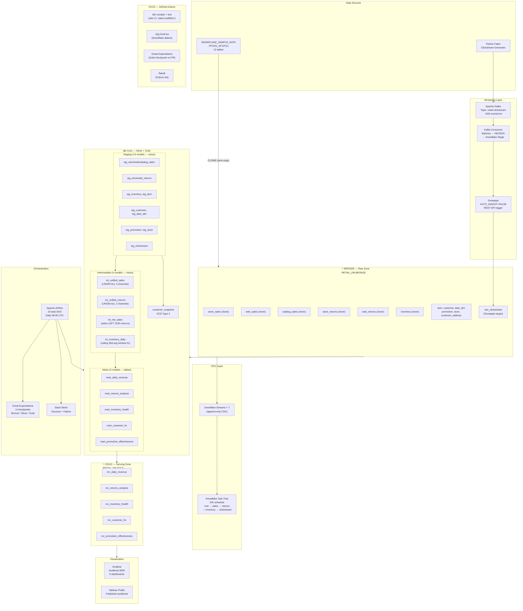

# architecture.md — Retail Intelligence Engine

## Full Pipeline Architecture

## Layer Responsibilities

| Layer | Schema | Owner | Rules |
|---|---|---|---|
| Bronze | RETAIL_DB.BRONZE | Data Engineer | Immutable. No transforms. No deletes. Append-only. |
| Silver | RETAIL_DB.SILVER | dbt | Type-cast, renamed, null-filtered, CDC-aware |
| Gold | RETAIL_DB.GOLD | dbt + Snowflake | Pre-aggregated tables + Materialized Views. BI connects here ONLY. |
